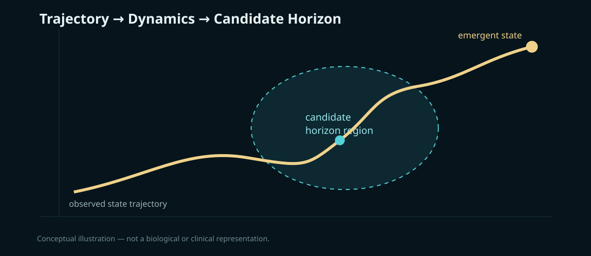
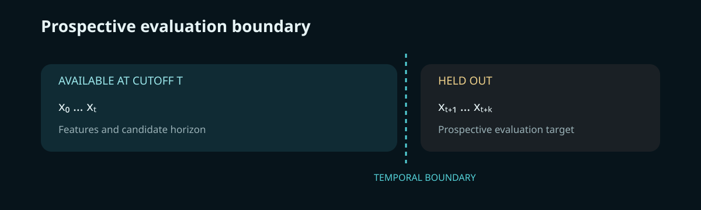

# Cellular Event Horizon (CEH)

### A computational framework for studying emergent cellular state transitions

**Research prototype · Python · Hypothesis-driven · Falsifiable**

> **Core question:** Can a measurable region of cellular state-space exist where individually subtle changes become collectively directional and converge toward an emergent cellular state?

---

## Concept

Most cellular analyses describe **where a cell is**.

CEH focuses on **how the cell is moving**.

`state(t0) → state(t1) → state(t2) → ... → state(tn)`

The proposed **Cellular Event Horizon** is not a biomarker, diagnosis, or binary label. It is a candidate dynamic region in state-space where several signals may become jointly detectable:

| Signal | Computational meaning |
|---|---|
| **Drift** | Departure from a reference cellular regime |
| **Directionality** | Persistence of movement through state-space |
| **Acceleration** | Change in the rate or direction of movement |
| **Convergence** | Independent trajectories approaching a common region |
| **Emergence** | Appearance of a new local state configuration |

The hypothesis is that the combination of these signals may contain information about an approaching cellular state transition that is not recoverable from a single snapshot.

---

## The CEH pipeline

```
Observations
     │
     ▼
Cell representation
     │
     ▼
Dynamic state-space
     │
     ▼
Temporal trajectory
     │
     ├── Drift
     ├── Directionality
     └── Acceleration
     │
     ▼
Multi-trajectory convergence
     │
     ▼
Candidate Event Horizon
     │
     ▼
Prospective evaluation
     │
     ▼
Null models + statistical validation
     │
     ▼
Reproducible evidence
```

---

## The critical experiment

The strongest version of CEH is **prospective**.

At a cutoff time **T**, the representation may use only:

`x₀ ... xₜ`

The future:

`xₜ₊₁ ... xₜ₊ₖ`

is reserved exclusively as an evaluation target.

The central test becomes:

> **Does information available before a transition contain a measurable CEH signal beyond what a snapshot-only model can recover?**

This constraint is essential because a retrospective system can describe a transition after seeing it. CEH is designed to test whether the signal can be identified without future-state leakage.

---

## Falsification first

CEH is not designed to prove its own hypothesis.

A meaningful result must survive progressively harder controls:

- synthetic null worlds;
- temporal shuffling;
- trajectory-identity permutation;
- noise and missing observations;
- snapshot-only baselines;
- parameter sensitivity;
- independent random seeds;
- held-out datasets;
- independent replication.

A negative result is a valid scientific outcome.

---

## Repository

```
src/ceh/
├── dynamics.py       # drift, velocity and acceleration
├── trajectory.py     # trajectory-level features
├── convergence.py    # multi-trajectory convergence
├── horizon.py        # candidate horizon components
├── nulls.py          # temporal and identity null models
├── prospective.py    # strict past/future separation
└── synthetic.py      # controlled synthetic worlds

experiments/
├── 001_temporal_falsification.py
├── 002_convergence_null.py
└── 003_prospective_boundary.py

docs/
├── hypothesis.md
├── mathematical-framework.md
├── cellular-event-horizon.md
├── convergence-null-model.md
├── prospective-horizon.md
├── validation-protocol.md
├── research-roadmap.md
└── visual-identity.md

tests/
└── ...
```

---

## Research roadmap

**01 — Formalization**  
Define the state representation, geometry, horizon criteria and uncertainty.

**02 — Synthetic falsification**  
Build controlled worlds with known transitions and explicit null worlds.

**03 — Benchmarking**  
Compare CEH features against snapshot-only and established trajectory-analysis baselines.

**04 — Prospective evaluation**  
Test whether pre-transition information carries signal about a later transition.

**05 — Biological datasets**  
Evaluate on public datasets with appropriate temporal or experimentally induced state transitions.

**06 — Multimodal extension**  
Investigate whether independent modalities provide convergent evidence for the same transition geometry.

**07 — Independent replication**  
Freeze the method and evaluate it on data not used during development.

---

## Scientific boundaries

CEH currently makes **no clinical claim**.

It is not:

- a cancer diagnostic;
- a prognostic system;
- a treatment recommendation engine;
- a medical device;
- a validated clinical biomarker;
- evidence that a biological "event horizon" physically exists.

The repository is computational infrastructure for testing a hypothesis.

---

## Status

**v0.1 — Research foundation**

The objective is not to make an impressive-looking model.

The objective is to determine whether the proposed phenomenon can be **defined, measured, falsified and reproduced**.

---

## License

MIT License.


## Research figures

### Trajectory and candidate horizon



### Prospective temporal boundary



These figures are conceptual diagrams of the computational hypothesis. They do not represent measured biological data or clinical performance.

## Reproducibility

The repository is intentionally structured so that scientific claims can be separated from implementation:

- **Core library:** inspectable numerical primitives in `src/ceh/`.
- **Experiments:** controlled synthetic studies in `experiments/`.
- **Tests:** executable invariants and expected numerical behavior in `tests/`.
- **Validation:** explicit null models, prospective boundaries and baseline comparisons in `docs/`.
- **Citation:** machine-readable metadata in `CITATION.cff`.

Run the test suite locally with:

```bash
python -m pip install -e ".[dev]"
pytest
```

## Research status

No biological conclusion is encoded in the repository at this stage. The next milestone is not a larger model; it is stronger evidence: repeated null distributions, snapshot-only baselines, robustness analysis, and evaluation on appropriate public datasets.
