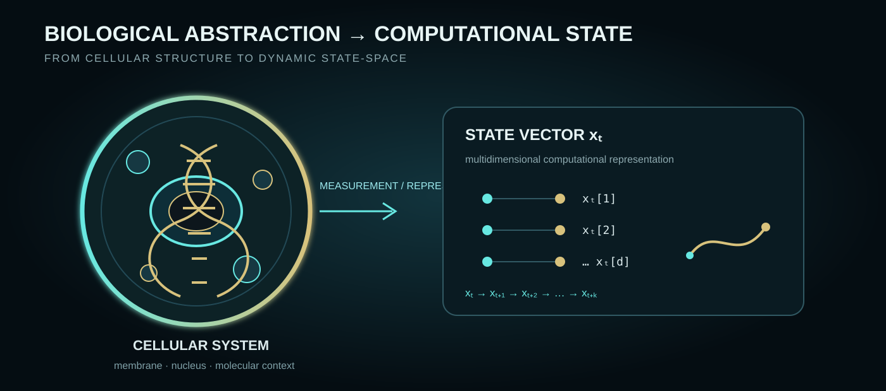

<div align="center">

# ⟐ Cellular Event Horizon

### A computational framework for studying emergent cellular state transitions


</div>

<p align="center">
  
</p>

> **Research question**
>
> **Can a measurable region of cellular state-space exist where individually subtle changes become collectively directional and converge toward an emergent cellular state?**

---

## 🧬 The idea

A conventional snapshot asks:

**“What state is this cell in?”**

CEH asks a different question:

**“Where is this cell going — and does its trajectory begin to reveal a transition before the new state becomes obvious?”**

The proposed **Cellular Event Horizon** is a computational region in dynamic state-space where multiple weak signals may become jointly structured:

| Biological / dynamical signal | Computational interpretation |
|---|---|
| 🧬 **State** | Multidimensional representation of a cell |
| ↗ **Drift** | Departure from a reference regime |
| ➜ **Directionality** | Persistence of movement through state-space |
| ∿ **Acceleration** | Change in the dynamics of movement |
| ⟿ **Convergence** | Independent trajectories approaching a common region |
| ✦ **Emergence** | Formation of a new local state configuration |

**CEH is a hypothesis, not an established biological phenomenon.**

---

## ◉ From cell state to cellular trajectory

```
        CELLULAR STATE-SPACE
               │
               ▼
       ┌─────────────────┐
       │  x₀  →  x₁  → x₂│
       └─────────────────┘
          ↘    ↘    ↘
           trajectory
               │
      ┌────────┼────────┐
      ▼        ▼        ▼
    drift   direction  acceleration
      └────────┼────────┘
               ▼
        convergence field
               │
               ▼
      ◉ CANDIDATE HORIZON
               │
               ▼
         emergent state
```

The important object is therefore not only the endpoint.

It is the **geometry and temporal structure of the path**.

---

## 🧬 Biological abstraction



CEH does not assume that a biological cell is directly equivalent to a vector. The computational state is an explicit abstraction: observations are transformed into a representation that can be analyzed over time. The scientific burden is therefore twofold — validate the trajectory mathematics **and** test whether the chosen representation preserves information relevant to the biological transition of interest.

## 🗺️ Cellular state-space


The map above is intentionally conceptual: the horizon is represented as a **region of trajectory geometry**, not as a physical boundary inside a cell. The scientific question is whether this region can be operationalized and distinguished from structures produced by noise, sampling, or ordinary trajectory compression.

## 🧫 A cellular system, treated as a dynamical system

Conceptually, a cell is represented as:

```
xₜ ∈ ℝᵈ

X = {x₀, x₁, …, xₜ}

vₜ = xₜ − xₜ₋₁

aₜ = vₜ − vₜ₋₁
```

The candidate horizon combines measurable properties of the trajectory:

```
Hₜ = f(Dₜ, Qₜ, Aₜ, Cₜ)
```

where:

- **Dₜ** = drift
- **Qₜ** = directional persistence
- **Aₜ** = acceleration
- **Cₜ** = convergence

The exact function is deliberately kept transparent in v0.1.

---

## 🧪 The experiment that matters

### Prospective evaluation

At time **T**, CEH is allowed to see only:

```
x₀ ── x₁ ── x₂ ── ... ── xₜ
                         │
                  TEMPORAL BOUNDARY
                         │
                         ✕
                  xₜ₊₁ ... xₜ₊ₖ
```

The future is **not** allowed to influence the candidate horizon.

It becomes the evaluation target.

> **Does pre-transition trajectory information contain signal beyond what a snapshot-only model can recover?**

This is the central scientific challenge.

---

## 🔬 Falsification architecture

CEH is deliberately built so that the hypothesis can fail.

```
                OBSERVED WORLD
                      │
          ┌───────────┴───────────┐
          ▼                       ▼
    temporal order           null worlds
          │                       │
          ▼                       ├─ time shuffle
    CEH trajectory                ├─ identity permutation
          │                       ├─ noise / missingness
          ▼                       └─ no-transition controls
   candidate horizon
          │
          ▼
   ┌─────────────────┐
   │ snapshot-only   │
   │     baseline    │
   └────────┬────────┘
            ▼
      effect + uncertainty
            │
            ▼
       reproducible evidence
```

A positive-looking signal that disappears under appropriate controls is not treated as evidence for CEH.

A robust negative result is scientifically useful.

---

## 🧬 Biological interpretation — carefully bounded

The framework is intentionally domain-agnostic.

Potential future applications may include the study of:

**cell transformation · resistance · differentiation · inflammatory transitions · aging · reprogramming · stimulus response**

These are **research directions**, not demonstrated applications of CEH.

The repository currently makes **no diagnostic, prognostic, therapeutic, or clinical claim**.

---

## 🧭 Repository architecture

```
Cellular Event Horizon
│
├── 🧠 src/ceh/
│   ├── dynamics.py       → velocity / acceleration / drift
│   ├── trajectory.py     → trajectory features
│   ├── convergence.py    → multi-trajectory geometry
│   ├── horizon.py        → candidate horizon components
│   ├── nulls.py          → null-model machinery
│   ├── prospective.py    → temporal boundary
│   └── synthetic.py      → controlled worlds
│
├── 🧪 experiments/
│   ├── 001_temporal_falsification.py
│   ├── 002_convergence_null.py
│   └── 003_prospective_boundary.py
│
├── 🧬 docs/
│   ├── hypothesis.md
│   ├── mathematical-framework.md
│   ├── cellular-event-horizon.md
│   ├── convergence-null-model.md
│   ├── prospective-horizon.md
│   ├── validation-protocol.md
│   └── research-roadmap.md
│
└── 🧫 tests/
    ├── test_core.py
    ├── test_convergence.py
    └── test_prospective.py
```

---

## 🔬 Evidence architecture


CEH separates **a computational signal from a scientific claim**. A signal first has to be identifiable in controlled worlds, survive temporal and null-model controls, demonstrate incremental information beyond simpler baselines, and eventually reproduce outside the development setting.

This is deliberately stricter than optimizing a single predictive score.

## 📐 Research principles

| Principle | CEH implementation |
|---|---|
| **Temporal integrity** | Future observations never enter cutoff features |
| **Falsifiability** | Explicit null worlds and failure criteria |
| **Transparency** | Interpretable v0.1 components |
| **Reproducibility** | Tests, deterministic controls and documented experiments |
| **Baseline challenge** | Snapshot-only comparison is required |
| **Uncertainty** | Statistical inference is treated as a first-class layer |
| **Scientific restraint** | No biological or clinical conclusion without evidence |

---

## 🚀 Research roadmap

**01 · Formalization** → mathematical definition  
**02 · Synthetic worlds** → controlled transitions + nulls  
**03 · Baselines** → snapshot vs temporal information  
**04 · Prospective testing** → pre-transition signal  
**05 · Biological benchmarks** → public datasets  
**06 · Multimodal dynamics** → independent evidence streams  
**07 · Independent replication** → frozen method / unseen data

---

## 📊 Current status

**v0.1 · Research foundation**

The current repository establishes the computational skeleton.

The next meaningful milestone is **not a larger neural network**.

It is stronger evidence:

- repeated permutation null distributions;
- snapshot-only baselines;
- effect sizes and uncertainty;
- robustness to noise and missingness;
- controlled transition benchmarks;
- evaluation on appropriate public biological datasets;
- independent replication.

---

<div align="center">

### ⟐ Define · Measure · Falsify · Reproduce ⟐

**Cellular Event Horizon (CEH)**  
*Research prototype — computational hypothesis*

</div>
