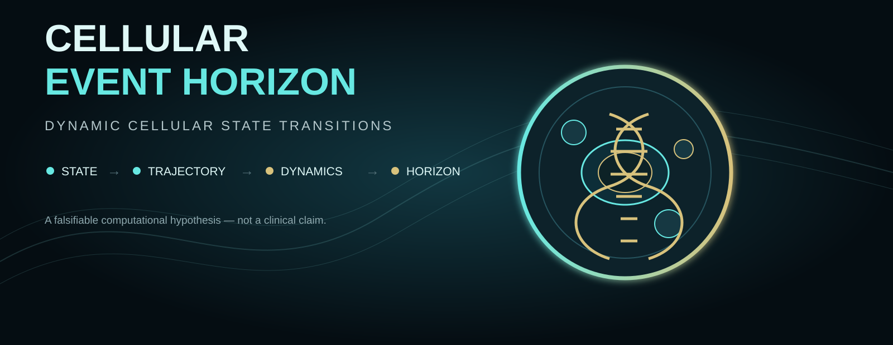
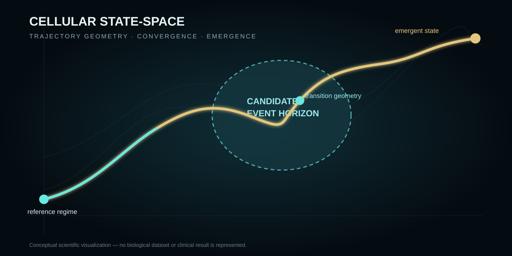
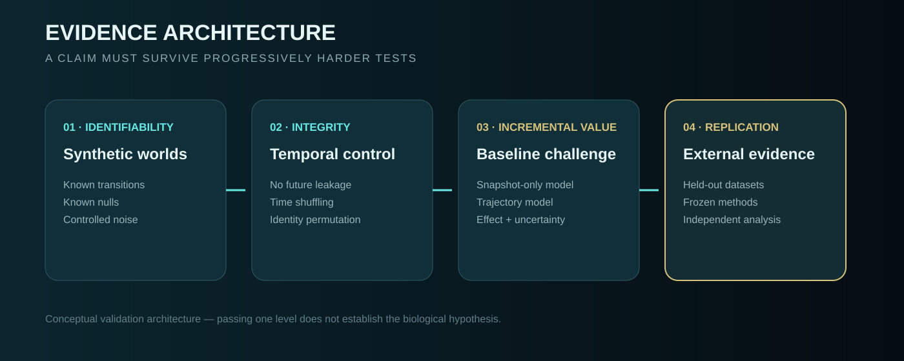

<div align="center">

# ⟐ Cellular Event Horizon

### A research program for measurable biological dynamics, state transitions and perturbation


</div>

<p align="center"></p>

> **Parent research question**
>
> **Can biological systems be represented as measurable dynamical systems whose state transitions, emergent behavior and responses to perturbation can be inferred, tested and compared across biological scales?**

> **First experimental construct**
>
> **Can a measurable region of cellular state-space exist where individually subtle changes become collectively directional and converge toward an emergent cellular state?**

---

## ⚛️ Physical and nuclear-physics interface

The research architecture is being extended downward into physical scales of biological organization: radiation track structure, microdosimetry, stochastic DNA damage, chromatin mechanics and nuclear phase behavior.

This is not a claim that atomic nuclear physics and cell-nucleus biology are the same problem. The connection is through radiation physics, biophysics, statistical physics and multiscale modelling.

```
PHYSICAL PERTURBATION
        ↓
ENERGY DEPOSITION / MICRODOSIMETRY
        ↓
DNA + CHROMATIN RESPONSE
        ↓
NUCLEAR STATE
        ↓
CELLULAR STATE
        ↓
DYNAMICAL TRAJECTORY
        ↓
TRANSITION GEOMETRY
        ↓
CEH HYPOTHESIS
```

Radiation-track research shows that biological effects depend on the spatial and temporal structure of energy deposition, not only on total dose, and that these effects can be studied with Monte Carlo track-structure and micro/nanodosimetry approaches. citeturn0search5turn0search9

The cell nucleus also behaves as a dynamic physical material involving chromatin mechanics and phase-separated nuclear condensates. citeturn0search0turn0search3

The purpose of this interface is to ask whether physical perturbations can be connected quantitatively to changes in latent biological-state dynamics, without assuming that such a connection exists.

See [docs/nuclear-physics-interface.md](docs/nuclear-physics-interface.md).

## 🛡️ Adversarial mechanisms

A transition detector must also survive processes that **look like transitions but are not the target transition**.

The project now explicitly challenges CEH with:

```
TRUE TRANSITION
      vs
TRANSIENT AMPLIFICATION
      vs
NOISE / SPATIAL CLUSTERING
```

A stable non-normal system can generate large transient excursions while its eigenvalues remain stable, providing an important control against interpreting amplification as bifurcation. Recent work has shown that pseudo-bifurcation-like warning signatures can arise through this mechanism. citeturn0search11

The repository also treats noise distribution as a scientific variable. Classical variance/autocorrelation warning signals can behave differently under non-Gaussian noise, including alpha-stable processes. citeturn0search7

Finally, spatially clustered microscopic events are tested independently from transition labels, motivated by the known spatial clustering of energy deposition and DNA damage in radiation track structure. citeturn0search1turn0search2

See [docs/adversarial-null-mechanisms.md](docs/adversarial-null-mechanisms.md).

## 🧬 Nonlinear Dynamics Laboratory

## 🌌 Multiscale physical-to-cellular bridge

The synthetic architecture now separates five layers:

```
PHYSICAL PERTURBATION
        ↓
DAMAGE
        ↓
REPAIR
        ↓
NUCLEAR STATE
        ↓
CELLULAR STATE
```

This follows a scientifically motivated multiscale direction: radiation track structure can produce spatially clustered molecular damage, while chromatin and nuclear organization influence downstream response. citeturn0search1turn0search8turn0search13

The implementation is deliberately phenomenological. It is **not** a radiation transport simulator and does not claim to reproduce real radiobiological parameters.

The key experimental question is now:

> Does information from upstream physical/nuclear layers improve prospective transition prediction beyond the instantaneous cellular state and established temporal indicators?

The repository compares these layers against variance, lag-1 autocorrelation and relaxation-rate baselines before attributing any additional signal to CEH.

See [docs/multiscale-architecture.md](docs/multiscale-architecture.md).


CEH is now tested inside a controlled nonlinear dynamical system with known ground truth.

The first laboratory uses the canonical saddle-node normal form:

$
\\dot{x}=\\mu-x^2
$

This provides explicit fixed points, local stability, a bifurcation boundary and a stochastic extension. It is a mathematical laboratory, not biological evidence.

The purpose is deliberately adversarial: CEH candidates must add information beyond established critical-transition indicators such as critical slowing down, variance and autocorrelation. citeturn0search0turn0search12

See [docs/nonlinear-dynamics-lab.md](docs/nonlinear-dynamics-lab.md).

## 🧭 Research logic

CEH is organized as a falsifiable research program, not as a single algorithm.

### 01 — Start with the system

The project begins at the physical and biological layers and moves upward:

```
PHYSICAL ENVIRONMENT
        ↓
MOLECULAR EVENTS
        ↓
DNA / CHROMATIN
        ↓
NUCLEAR STATE
        ↓
CELLULAR STATE
        ↓
OBSERVABLE DATA
```

Not every experiment requires every layer. A layer is introduced when it can be measured, simulated or independently justified.

### 02 — Separate observation from state

Measurements are observations of a potentially hidden state:

`[
Y_t = h(X_t) + eta_t
]`

The first question is therefore whether the relevant biological state can be reconstructed well enough to study its dynamics.

### 03 — Model dynamics explicitly

The state may evolve through deterministic, stochastic and intervention-dependent processes:

`[
dX = f(X,t,u)dt + G(X,t,u)dW_t
]`

Noise, perturbation and uncertainty are part of the model rather than implementation details.

### 04 — Establish mathematical ground truth

Before interpreting biology, CEH is challenged inside controlled dynamical systems.

The current nonlinear laboratory uses:

`[
dot{x}=mu-x^2
]`

This provides known fixed points, stability and a saddle-node bifurcation. The purpose is to test the machinery where the transition mechanism is already known.

### 05 — Challenge CEH against existing signals

CEH must not simply rename established early-warning indicators.

Candidate signals are compared against:

- snapshot state;
- temporal-history baselines;
- variance;
- lag-1 autocorrelation;
- relaxation dynamics;
- shuffled-time nulls;
- no-transition worlds;
- matched perturbation controls.

### 06 — Add the physical-to-cellular bridge

The multiscale laboratory currently represents:

```
PERTURBATION
    ↓
DAMAGE
    ↓
REPAIR
    ↓
NUCLEAR STATE
    ↓
CELLULAR STATE
```

This is intentionally phenomenological. It is a computational scaffold, not a validated radiation-transport or radiobiological model.

### 07 — Search for transition geometry

Only after these controls do we ask whether a transition-relevant region exists in latent state space.

A CEH candidate must be:

- prospective;
- reproducible;
- robust to noise and missingness;
- distinguishable from matched null dynamics;
- informative beyond instantaneous state;
- tested against alternative explanations.

### 08 — Perturb and close the loop

The research cycle is:

```
OBSERVE
   ↓
REPRESENT
   ↓
MODEL
   ↓
FALSIFY
   ↓
PREDICT
   ↓
PERTURB
   ↓
REMEASURE
   ↓
REVISE
```

A positive result is not enough. The model must survive competing explanations.

### Central question

> Can a transition-relevant region of biological state space be identified prospectively, and can its information content be demonstrated to exceed what is available from the instantaneous state, established temporal indicators, observation artifacts and matched null dynamics?

## 🧠 Theoretical depth

CEH is being developed against established frameworks in dynamical systems, stochastic modelling, attractor landscapes, bifurcation theory and single-cell systems biology. These frameworks define the theoretical territory that the hypothesis must confront; they are not claimed as inventions of this project.

> Can a transition-relevant region of latent biological state space be inferred prospectively from observations available before the transition, and does that region contain information beyond the instantaneous state, generic temporal dynamics and representation-specific artifacts?

### Mathematical stack

```text
OBSERVATION
    y_t = h(x_t) + η_t
             │
             ▼
LATENT STATE
    x_t ∈ M
             │
             ▼
DYNAMICAL SYSTEM
    dx = f(x,t)dt + G(x,t)dW_t
             │
      ┌──────┴──────┐
      ▼             ▼
  ATTRACTORS    TRANSIENT GEOMETRY
      │             │
      └──────┬──────┘
             ▼
      TRANSITION RISK
             │
             ▼
       CEH HYPOTHESIS
             │
             ▼
       PROSPECTIVE TEST
             │
             ▼
       INTERVENTION
             │
             ▼
       MODEL REVISION
```

### Four layers that must not be conflated

1. **Measurement** — what the experiment actually observes.
2. **State inference** — the latent representation reconstructed from observations.
3. **Dynamics** — how the inferred state evolves.
4. **Biological interpretation** — claims that require independent evidence.

### What CEH is not

CEH is not an established biological structure, clinical biomarker, cancer detector, or attractor by definition. It is a falsifiable hypothesis.

Existing systems-biology work already provides strong foundations around cellular dynamical systems, attractors, trajectories and bifurcation-based transition analysis. The repository therefore focuses on whether the proposed construct adds measurable information under controlled and empirical tests.

## 🧬 From CEH to Universal Biological Dynamics

CEH is no longer framed as an isolated algorithmic idea. It is the first research construct inside a broader program: **Universal Biological Dynamics**.

The program connects:

**Biological observation → state reconstruction → dynamics → transition → prediction → perturbation → remeasurement → generalization**

The word **universal** is used as a research target, not a claim that one model explains all biology. The objective is to search for transferable dynamical principles that survive changes in biological system, modality, scale, condition and dataset.

[Read the research program →](docs/universal-biological-dynamics.md)

---

## 🧬 The biological system as a dynamical system

A biological state is not assumed to be one measurement. Depending on the experiment, it may integrate molecular, spatial, morphological, metabolic, mechanical, environmental and behavioral evidence.

```
S_(t+1) = F(S_t, E_t, u_t) + ε_t
```

Where:

- **S_t** — biological state;
- **E_t** — environment/context;
- **u_t** — intervention or perturbation;
- **ε_t** — process/measurement uncertainty.

This is an engineering abstraction for testing hypotheses, not a claim that biology is reducible to one equation.

---

## ◉ The CEH construct



CEH asks whether a transition region can be operationalized through measurable properties such as:

| Signal | Interpretation |
|---|---|
| 🧬 State | Multidimensional biological representation |
| ↗ Drift | Departure from a reference regime |
| ➜ Directionality | Persistent movement through state-space |
| ∿ Acceleration | Change in movement dynamics |
| ⟿ Convergence | Independent trajectories approaching a region |
| ✦ Emergence | New local state configuration |

**CEH is a falsifiable hypothesis, not an established biological phenomenon.**

---

## 🧪 The closed research loop

```
OBSERVE
   ↓
REPRESENT
   ↓
MODEL
   ↓
FALSIFY
   ↓
PREDICT
   ↓
PERTURB
   ↓
REMEASURE
   ↓
GENERALIZE
```

The critical extension is **perturbation**. A computational prediction becomes substantially more informative when an experimentally defined intervention can challenge the inferred dynamics.

---

## 🔬 Evidence architecture



A signal is not automatically a scientific discovery. The program requires:

1. identifiability in controlled worlds;
2. temporal integrity;
3. null-model survival;
4. incremental value beyond simpler baselines;
5. robustness and uncertainty;
6. external replication;
7. experimental challenge where possible.

---

## 🧫 Multimodal biology

The long-term framework is designed to compare independent evidence streams rather than treating one modality as the biological truth.

```
molecular ─┐
imaging ───┤
spatial ───┤
metabolic ─┼──► STATE RECONSTRUCTION ─► DYNAMICS
mechanical ┤
context ───┘
```

A key research question is whether independent modalities converge on the same transition geometry.

---

## 🧭 Research architecture

```
Universal Biological Dynamics
│
├── State Reconstruction
├── Multimodal Integration
├── Dynamical Systems
├── Transition Detection
├── Cellular Event Horizon
├── Perturbation & Intervention
├── Causal Challenge
├── Resilience / Memory
└── Cross-System Generalization
```

CEH is therefore a module inside a larger research architecture, not the claim that one score solves biological state transitions.

---


## 🌐 Synthetic Biological World

The program now contains a controlled synthetic world in which the generating dynamics, perturbation point and transition boundary are known by construction.

It exists for one reason: **test the research architecture before touching biological data**.

```
KNOWN DYNAMICS
      ↓
PERTURBATION
      ↓
NOISY OBSERVATIONS
      ↓
STATE RECONSTRUCTION
      ↓
CEH / DYNAMICAL ANALYSIS
      ↓
HELD-OUT FUTURE
      ↓
COMPARE WITH GROUND TRUTH
```

The world can independently introduce observation noise and missingness. It is explicitly labeled a methodological benchmark, not a biological simulation or biological evidence.

## 🧠 Research ontology

The program now uses an explicit scientific vocabulary so that computational objects are not confused with biological claims:

```
OBSERVATION ≠ STATE
STATE ≠ TRAJECTORY
TRAJECTORY ≠ CAUSAL MECHANISM
PREDICTION ≠ CAUSALITY
CORRELATION ≠ BIOLOGICAL PROOF
```

The complete experimental object connects **state, context, trajectory, perturbation, response, time and uncertainty**.

[Read the research ontology →](docs/research-ontology.md)

## 🧪 Experimental ladder

Synthetic identifiability → temporal integrity → baseline challenge → multimodal convergence → perturbation challenge → cross-system transfer → independent replication.

[Read the experimental design →](docs/experimental-design.md) · [Read the benchmark matrix →](docs/benchmark-matrix.md)

## 🧬 Biological scope

Potential research domains include:

**cell transformation · differentiation · resistance · inflammation · aging · reprogramming · stimulus response · regeneration · host-microbe dynamics**

These are research directions, not demonstrated applications.

The repository currently makes no diagnostic, prognostic, therapeutic or clinical claim.

---

## 🧪 CEH Benchmark

The benchmark is now the central falsification layer of the project.

It forces the candidate CEH construct to compete under the same prospective protocol against:

```
SNAPSHOT
   ↓
TEMPORAL HISTORY
   ↓
EARLY-WARNING STATISTICS
   ↓
CANDIDATE CEH
```

Every score is computed from observations available at the cutoff only. The transition label is defined independently from the predictor, so future observations cannot leak into the score.

The first benchmark compares:
- a controlled nonlinear transition;
- stable non-normal dynamics as an adversarial null;
- snapshot, temporal, early-warning and candidate CEH signals;
- AUROC and AUPRC under identical cutoffs.

The benchmark is deliberately allowed to fail. A CEH signal is scientifically interesting only if it provides reproducible incremental information beyond simpler alternatives and survives adversarial null mechanisms.

[Read the CEH benchmark protocol →](docs/ceh-benchmark.md)

## 🚀 Roadmap

**01** Program definition  
**02** Synthetic worlds and falsification  
**03** Baseline challenge  
**04** Prospective transition testing  
**05** Multimodal state reconstruction  
**06** Biological benchmarks  
**07** Perturbation-response experiments  
**08** Cross-system generalization  
**09** Independent replication  
**10** Translation only after evidence

---

## 📐 Scientific principles

**Measure before interpreting.**  
**Separate state from trajectory.**  
**Separate prediction from causality.**  
**Never use future observations to construct the past.**  
**Compare against strong existing methods.**  
**Expose uncertainty.**  
**Treat negative results as information.**  
**Do not convert computational signals into biological claims without evidence.**

---

## 📊 Current status

**v0.2 · Universal Biological Dynamics architecture**

The repository now defines CEH as the first experimental construct inside a broader research program.

The next milestone is not a larger model. It is evidence that survives controlled synthetic worlds, established baselines, temporal separation, multimodal validation and eventually experimental perturbation.

<div align="center">

### ⟐ Observe · Represent · Model · Falsify · Perturb · Reproduce ⟐

**Cellular Event Horizon (CEH)**  
*Research prototype — evolving biological dynamics program*

</div>
